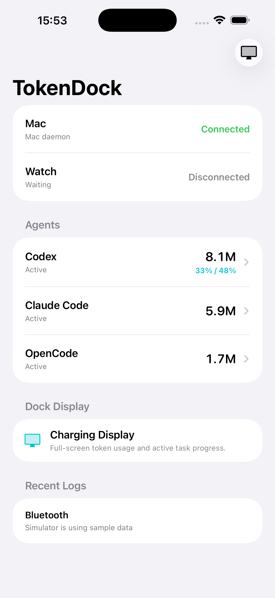
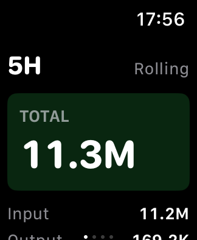

# TokenDock iPhone and Watch App

TokenDock is the iPhone and Apple Watch companion for local agent token usage. The Mac daemon publishes snapshots over Bluetooth LE, the iPhone app receives and caches them, and the Watch app displays compact 5H, Today, 7D, and 30D usage views.

The iPhone app is intentionally simple: it is a bridge status surface, log/cache viewer, and dock display. The Apple Watch remains the primary glanceable daily display.

## Screenshots





## Screens

- Home: Mac connection status, Watch sync status, usage remaining, and agent list.
- Agent detail: 5H, Today, 7D, 30D totals plus input/output/cache/reasoning breakdowns.
- Dock display: charging-friendly display mode for portrait and landscape.
- Watch app: swipeable 5H, Today, 7D, and 30D token usage screens.

## Current Scope

- Receives `agent_usage_snapshot` payloads from the Mac daemon over BLE.
- Keeps the data model multi-agent from day one.
- Persists the latest snapshot to Application Support.
- Appends bridge events to a JSONL log.
- Syncs the latest snapshot to Apple Watch with WatchConnectivity.
- Includes mock Codex, Claude Code, and OpenCode data for simulator previews and fallback UI.
- Includes an Xcode project with an embedded Watch app and Watch extension.

## Local Storage

The app stores bridge state under Application Support:

```text
AgentUsageBridge/
  latest-snapshot.json
  bridge-events.jsonl
```

`latest-snapshot.json` keeps the most recent daemon payload so the app can show data after restart. `bridge-events.jsonl` is an append-only event log for receive, sync, disconnect, and cache-load events.

## Commands

Run the no-dependency test runner:

```bash
swift run agent-usage-bridge-tests
```

Build the package:

```bash
swift build
```

## Xcode Integration

Open `AgentUsageBridge.xcodeproj` in Xcode. The project contains the iPhone app target, embedded `TokenDock Watch` app target, and `TokenDock Watch Extension` target.

See `TESTING_ON_IPHONE.md` for the full manual iPhone testing flow.

For physical Apple Watch installs, make sure the Mac, iPhone, and Watch are on the same Wi-Fi and that Xcode can read the Watch OS version. If Xcode shows `watchOS ()` or reports that the OS version is lower than the deployment target, let Xcode finish connecting to the watch and copying shared cache symbols before installing.

## iPhone Readiness Check

Run:

```bash
./scripts/check-iphone-readiness.sh
```

If full Xcode is selected, open the package with:

```bash
./scripts/open-package-in-xcode.sh
```
